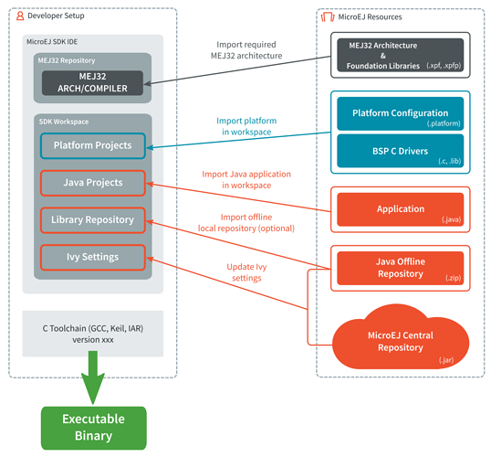

.. Copyright 2020 MicroEJ Corp. All rights reserved.
.. Use of this source code is governed by a BSD-style license that can be found with this software.

Building a MicroEJ firmware
===========================

A MicroEJ firmware is built from several input resources and tools. Each resource and tool has a specific version that must be carefully respected in order to build a firmware.

This project describes the components involved and the process to build a MicroEJ firmware.

Requirements
============

* MicroEJ SDK 4.x is installed with an activated license (evaluation license or production license).
* The reader is familiar with the MicroEJ glossary https://developer.microej.com/glossary.html
* The reader has run one of the MicroEJ SDK getting started https://developer.microej.com/getting-started-sdk.html
* The reader has access to the MicroEJ SDK developer guide (pdf, see on developer.microej.com -> guide).

The MicroEJ SDK IDE [.exe or .zip].
-----------------------------------

* Download from https://developer.microej.com/getting-started-sdk.html

MEJ32 architecture [.xpf, .xpfp]
--------------------------------

A MEJ32 architecture contains the runtime port to a target instruction set (ISA) and a C compiler (CC) and MicroEJ Foundation Libraries.

The MEJ32 architectures are distributed into 2 formats:

* EVAL: evaluation license with runtime limitations (explained in SDK developer guide).
* DEV: production license (these versions are only distributed by MicroEJ sales & Customer Care team).

The list of supported MEJ32 architectures can be found here https://developer.microej.com/products.html#arch.

The MEJ32 architecture is either provided from:

* the ``/platformArchitecture`` folder in a MicroEJ platform reference implementation (downloaded from https://developer.microej.com/).
* MicroEJ sales or customer care team.
* For DEV license only: SDK license site https://license.microej.com/ (MyProduct->Download additional products will list the downloads available for your account).

A MEJ32 architecture must be imported in SDK with:

* ``File->Import…``
* ``MicroEJ->Platform, Virtual devices and Architectures``
* ``Select directory -> Browse…, choose x/platformArchitecture/ > OK``
* Accept the license (Check the ``I agree...`` box)
* ``Finish``.

MicroEJ platform source (.zip)
------------------------------
  
This package includes:

* the build of a C board support package (BSP, with or without RTOS),
* a MEJ32 Architecture,
* the adaptation layers (ADLAs),
* the MicroEJ Simulator and its associated MicroEJ Mocks.

The zip files contains:

* ``<platform>-configuration``: The configuration of the MicroEJ Platform
* ``<platform>-bsp``: The C code for the board-specific files (drivers).
* Must be compiled with a compiler.
* ``<platform>-fp``: Front panel mockup for the simulator.

To generate the platform:

* In the ``<platform>-configuration``: open the ``.platform`` file and verify the correct MEJ32 architecture is used (see Content view).
* Click on ``Build Platform``. This action generates a ``<platform>-<ISA>-<CC>-<VERSION>`` folder that contains the platform runtime library (``microejruntime.lib``).
* This library is usually directly linked from the ``<platform>-bsp`` project (no manual action to do after the build). Follow the README instructions inside the platform .zip.

Java application project (.zip)
-------------------------------

This Java project can be configured (in the ``Run configurations ...`` properties):

* to either run on:

  * a simulator (computer desktop),
  * a device (actual embedded hardware).

* to setup:

  * memory (example: Java heap, Java stack),
  * foundation libraries,
  * etc…

This project is compiled against (and optimized for) a specific MicroEJ SDK platform:

* Generates a ``microejapp.o`` (native object code) that is usually directly linked from the ``<platform>-bsp`` project (no manual action to do after the build).

* Go in:

  * ``Run -> Run configurations``
  * select the provided ``MicroEJ Application`` launchers
  * click on ``Run``

* Must be imported in SDK with: ``File > Import… > General > Existing Projects into Workspace > Select archive file > Browse…``, choose ``x.zip`` and ``Finish`` import.

Ivy repository
--------------

* MicroEJ Central Repository: an online repository of software artifacts (libraries, tools, …), see https://repository.microej.com/.

* (Optional) Can be extended with an offline repository (``.zip``) that can be imported in the workspace:
  
  * Unzip the ``x-repository-M.m.p.zip`` file.
  * Open MicroEJ SDK.
  * Go to ``Window > Preferences > Ivy > Settings``.
  * Configure the ``Ivy settings`` path by clicking the ``File System...`` button.
  * Select the ``ivysettings.xml`` file available in the directory where you have previously unzipped the ``x-repository-M.m.p.zip`` file.

C compiler (GCC, KEIL, IAR, …).
-------------------------------

Used to compile and link the following files into the final firmware (binary, hex, elf, … that will be programmed on the hardware):
  
  * the ``microejapp.o`` (application),
  * the ``microejruntime.lib`` or ``microejruntime.a`` (platform),
  * the BSP C files (drivers).
