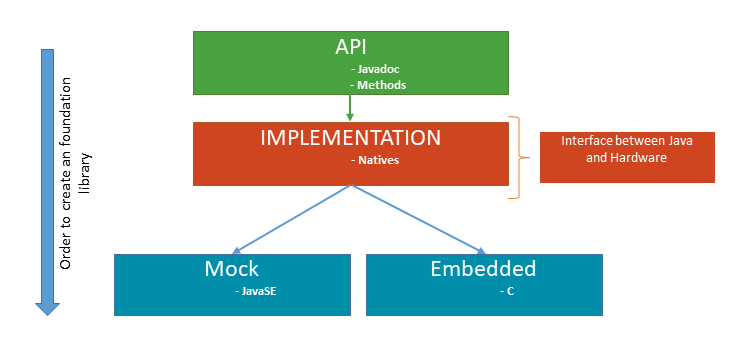

<!--
	Readme
	Copyright 2018 IS2T. All rights reserved.
	IS2T PROPRIETARY/CONFIDENTIAL. Use is subject to license terms.
-->

# How to Create a Foundation Library #

A Foundation Library is a library that provides core runtime APIs or hardware-dependent functionality. It is often connected to underlying C low-level APIs.



## Prerequisites ##

1. MicroEJ SDK 4.1.4 installed.
2. A MicroEJ 4.1 Platform Reference Implementation imported into the MicroEJ repository. See (https://developer.microej.com/getting-started-sdk-stm.html).
3. An activated Evaluation or Production license.
4. Knowledge about Java and C programming.
5. Basic knowledge about MicroEJ (platform and standalone application build).
6. Knowledge how to communicate from Java to C .[Example-Standalone-Java-C-Interface](https://github.com/MicroEJ/Example-Standalone-Java-C-Interface)

# Create a Foundation Library

## Define the API Project

* Select **File > New > Other > EasyAnt > EasyAnt Project**
	* Set the project settings.
		* Project Name: mylib-api
		* Organizaton: com.mycompany.api
		* Module: mylib
		* Revision:  1.0.0
	* Select **com.is2t.easyant.skeletons#microej-javaapi;+** skeleton.
	* Click on finish.

* Select **File > New > Class**
	* Package: **com.mycompany**.
	* Name: **MyLib**.

In this class, define all the foundation libraries apis methods, their implementations throw a new RuntimeException.

```
package com.mycompany;

public class MyLib {
	/**
	 * Returns the factorial of number.
	 *
	 * @param number
	 *            Number to returns the factorial
	 *
	 * @return the factorial of number.
	 */
		public static int factorial(int number) {
			throw new RuntimeException();
		}
}
```

### Build the API

Right-click on the API project and click on **Build With EasyAnt**. This may take several minutes.
After successful build, the API project build folder **target~/artifacts** contains:

* **Jar** file (mylib.jar), that will be referenced by an application or a firmware.
* **Rip** file (mylib.rip), that will be embedded into a platform.

### Add the API to a Platform 

* Unzip the **Rip** file (mylib.rip) and copy the content directory in the **dropins/javaAPIs** directory of the __platform-configuration__ project.
* Rebuild your platform.

After successful build, the Javadoc of your API is available in the MicroEJ Resource Center View.

## Define the Implementation Project

### Java 

* Select **File > New > Other > EasyAnt > EasyAnt Project**
	* Set the project settings. 
		* Project Name: mylib-impl
		* Organizaton: com.mycompany.impl
		* Module: mylib
		* Revision:  1.0.0
	* Select **com.is2t.easyant.skeletons#microej-javaimpl;+** skeleton.
	* Click on finish.

 * Select **File > New > Class** .
	* Package: **com.mycompany**
	* Name : **MyLibNatives**
	
Define your native interfaces :
```
package com.mycompany;

/**
 * Class define all native.
 */
public class MyLibNatives {
	public native static int factorial(int number);
}
```

Java and Native calls are separate. With this organization, it is more easy to write the MOCK and to split the two parts if one wants to change support of implementation.

* Select **File > New > Class** .
	* Package: **com.mycompany**
	* Name : **MyLib**  [MyLib.java](/mylib-impl/src/main/java/com/mycompany/MyLib.java)
	* Use your native functions :  
	```
	package com.mycompany;

	public class MyLib {
		
		/**
		* @see API javadoc
		*/
		public static int factorial(int number) {
			if (number < 0) {
				throw new IllegalArgumentException("Factorial cannot be negative");
			}
			if (number == 0 || number == 1) {
				return 1;
			}
			return MyLibNatives.factorial(number);
		}
	}
	```
	In **Java**, you can test input value and throw an exception if the input value isn't correct. 

### Native C

* Copy and paste the following code inside the file content/include/intern/LLMYLIB_impl.h . 	
```
#define LLMYLIB_IMPL_factorial Java_com_mycompany_MyLibNatives_factorial
```
**Note** : The **com_mycompany_MyLibNatives** part is the fully qualified name of the **MyLibNatives** class created previously where all **.** are replaced by **_**.

**Note** : This file allows to cut the Java part and the C. If you change the packaging of your Java Native, you don't have to change your LLAPI, just need to edit this file.

Copy and paste the following code inside the file content/include/LLMYLIB_impl.h.
```
#ifndef LLMYLIB_IMPL
#define LLMYLIB_IMPL

/**
 * @file
 * @brief MicroEJ factorial low level API
 * @author My Company
 * @version 1.0.0
 */

#include <stdint.h>
#include <intern/LLMYLIB_impl.h>

#ifdef __cplusplus
extern "C" {
#endif

/*
 * Returns the factorial
 */
uint32_t LLMYLIB_IMPL_factorial(uint32_t number);

#ifdef __cplusplus
}
#endif
#endif
```

#### Build the Implementation

Right-click on the Implementation project and click on **Build With EasyAnt**. This may take several minutes.
After successful build, the Java project build folder **target~/artifacts** contains:

* **Rip** file, that will be embedded into a platform.

### Add the Implementation to a Platform 

* Unzip the **Rip** file and copy the content directory in the **dropins** directory of the __platform-configuration__ project.
* Rebuild your platform.

#### Write Example Application ###

* Create a new project **File > New > MicroEJ Standalone Application Project**
	* Project Name : **mylib-test**
	* Check **MYLIB-1.0** in the section **Runtime Environment > Select MicroEJ libraries**

* Select **File > New > Class >**
	* Package: **com.mycompany**
	* Class Name : **TestMyLib**
	* Copy and paste the following code :
```
package com.mycompany;

public class TestMyLib {
	public static void main(String[] args) {
		System.out.println("(5!)=" + MyLib.factorial(5));
	}
}
```

# Building for the simulator

## Getting a java.lang.UnsatisfiedLinkError exception

* Right-click on the example project **Run As > MicroEJ Application**
```
	The result of the previous step shall lead to this error message
	Exception in thread "main" java.lang.UnsatisfiedLinkError: No HIL client implementor found (timeout)
		at java.lang.Throwable.fillInStackTrace(Throwable.java:79)
		at java.lang.Throwable.<init>(Throwable.java:30)
		at java.lang.Error.<init>(Error.java:10)
		at java.lang.LinkageError.<init>(LinkageError.java:10)
		at java.lang.UnsatisfiedLinkError.<init>(UnsatisfiedLinkError.java:10)
		at com.mycompany.MyLib.factorial(MyLib.java:16)
		at my.company.TestMyLib.main(TestMyLib.java:8)
		at java.lang.MainThread.run(Thread.java:836)
		at java.lang.Thread.runWrapper(Thread.java:372)
	=============== [ Completed Successfully ] ===============

	SUCCESS
```
This is perfectly normal since in MyLibTest.java we declared **factorial** as a native function, when running the simulator, the Hardware In the Loop (HIL) engines expects to find some Java implementation emulating the behavior of the native function.


## Adding a mock of the native function to the JPF

Since our Java application relies on native C functions, on an embedded target, we would need to provide a C implementation. But given that we are running it on a Java simulator, we can emulate those functions using a Java mock.

* Select **File > New > Other > EasyAnt > EasyAnt Project**
	* Set the project settings. 
		* Project Name: mylib-mock
		* Organizaton: com.mycompany.mock
		* Module: mylib
		* Revision:  1.0.0
	* Select **com.is2t.easyant.skeletons#microej-mock;+** skeleton.
	* Click on finish.

The [mylib-mock project](/mylib-mock/) provides the mocks required for running the Java application on simulator.

* Copy and paste the following code inside the project (**Note** : If you don't want to make a mistake in definition of methods, copy directly [MyLibNatives.java](mylib-impl\src\main\java\com\mycompany\MyLibNatives.java) from your implementation in the project ) :

```
package com.mycompany;

/**
 * @see javadoc API
 */
public class MyLibNatives {

	public static int factorial(int number) {
		if (number == 0) {
			return 1;
		}
		int fact = 1; // this will be the result
		for (int i = 1; i <= number; i++) {
			fact *= i;
		}
		return fact;
	}
}
```

Note that the mock method in /mylib-mock/.../MyLibNatives.java has the same fully qualified name (package-name.class-name.method-name) as the one declaring the native in /mylib-impl/.../MyLibNatives.java. This allows the linker to find which method simulates the native function.

### Build the mock

Right-click on the mock project and click on **Build With EasyAnt**. This may take several minutes.
After successful build, the Java project build folder **target~/artifacts** contains:

* **Rip** file, that will be embedded into a platform.

### Add the Implementation to a Platform 

* Unzip the **Rip** file and copy the content directory in the **dropins** directory of the __platform-configuration__ project.
* Rebuild your platform.

## Relaunch the example

 Right-click on the example project  **Run As > MicroEJ Application**.
```
		=============== [ Initialization Stage ] ===============
		=============== [ Launching on Simulator ] ===============
		(5!)=120
		=============== [ Completed Successfully ] ===============

		SUCCESS
```

# Running the application on target

## Building for the target

	* Copy the simulator launcher
	* In **Execution** tab
		* In Target frame
			* Click the Browse button next to the JPF Field and select your platform
		* In Execution frame
			* Notice that "Execute on Device" radio button option is checked
	* Click on "Run"

### Getting a linker error (BSP specific)

* From the MicroVision IDE
	* Select **Project > Build Target** menu item (or press F7 keyboard shortcut)
	* A linker error message shall appear :
		```
			Undefined symbol Java_com_mycompany_MyLibNatives_factorial (referred from microejapp.o).
		```

This is perfectly normal since in [MyLibTest.java] we declared **factorial** as a native function, when building the MicroEJ project, the generated linker configuration file expects to find a C function definition matching the qualified name of the function.

## Fixing the linker error

### C Native function implementation

* Select your implemententation project and add a new directory, Select **File > New > Source Folder** menu item
	* Set the **Folder Name** field to "src/main/c"
* Right-Click on the folder that you just created
	* Select **New > File** context menu item
	* Set the **File Name** field to "[LLMYLIB_impl.c](/mylib-impl/src/main/c/LLMYLIB_impl.c)"
	* Copy and paste the following code inside the generated [LLMYLIB_impl.c]. Notice the C function follows the strict naming define in the **content/intern/include/LLMYLIB_impl.h**.
```
#include "LLMYLIB_impl.h"
#include "sni.h"

/**
 * @file
 * @brief MicroEJ factorial low level API
 * @author My Company
 * @version 1.0.0
 */
uint32_t LLMYLIB_IMPL_factorial(uint32_t number)
{
	if(number == 0)
		return 1;
	else
		return number * LLMYLIB_IMPL_factorial(number-1);
}
```

#### Adding the C file to the BSP IDE project structure (BSP specific)

* Add the previous file in your bsp project with your IDE.

#### Getting a clean link (BSP specific)

* Build target

### Flashing the board (BSP specific)

* Connect and flash your board.

### Checking the behavior

* Set up a terminal on the board serial port and press the reset input. You shall get the following output :
	```
	VM START
	(5!)=120
	VM END (exit code = 0)
	```