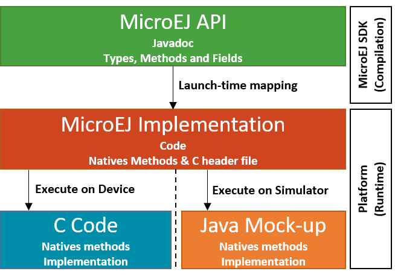

.. Copyright 2019 MicroEJ Corp. All rights reserved.
.. Use of this source code is governed by a BSD-style license that can be found with this software.

How to Setup a new Foundation Library
=====================================

This example describes how to setup a new Foundation Library in MicroEJ
SDK.

A Foundation Library is a library that provides core runtime APIs or
hardware-dependent functionality. It is often connected to underlying C
low-level APIs.

Prerequisites
-------------

Software
~~~~~~~~

This example has been tested on:

-  MicroEJ SDK 5.1
-  With a MicroEJ 5 Platform Reference Implementation imported into the
   MicroEJ repository that contains:

   -  EDC-1.2
   -  BON-1.3
   -  SP-2.0
   
   See https://developer.microej.com/getting-started-sdk.html.

Knowledge
~~~~~~~~~

-  Basic knowledge about Java and C programming.
-  Basic knowledge about MicroEJ (Platform build and Standalone
   Application launch).

Overview
--------

A Foundation Library is composed of 

-  A MicroEJ API project: contains API skeletons for compilation purpose.
-  A MicroEJ Implementation project: contains the runtime code executed by the Platform and Low Level C header files.
-  C code: contains the implementation of native methods linked to the C project.
-  Java Mock-up project: contains the implementation of native methods for simulation.

   LLAPI

Create the Foundation Library API
---------------------------------

Define the API Project
~~~~~~~~~~~~~~~~~~~~~~

-  Select **File > New > Other > EasyAnt > EasyAnt Project**

   -  Set the project settings.

      -  Project Name: mylib-api
      -  Organization: com.mycompany.api
      -  Module: mylib
      -  Revision: 1.0.0

   -  Select **com.is2t.easyant.skeletons#microej-javaapi;+** skeleton.
   -  Click on **Finish**.

-  Select **File > New > Class**

   -  Source folder: **mylib-api/src/main/java**.
   -  Package: **com.mycompany**.
   -  Name: **MyLib**.

-  Copy and paste the following code into this class:

::

   package com.mycompany;

   /**
    * My Foundation Library.
    */
   public class MyLib {
       /**
        * Computes the factorial of an integer.
        *
        * @param number
        *            a positive integer
        *
        * @return the factorial of number.
        */
       public static int factorial(int number) {
           throw new RuntimeException();
       }
   }

This class defines a *factorial* API. The method content is filled with
**throw a new RuntimeException** just for successful compilation.

Build the API Project
~~~~~~~~~~~~~~~~~~~~~

Right-click on **mylib-api** project and select **Build With EasyAnt**.
After a successful build, the project build directory
**target~/artifacts** contains:

-  **Jar** file (mylib.jar), that will be used by an Application.
-  **Rip** file (mylib.rip), that will be embedded into a Platform.

Add the API to the Platform
~~~~~~~~~~~~~~~~~~~~~~~~~~~

-  Unzip **mylib.rip** and copy all the files of the **content**
   directory into the **dropins** directory of the
   **[platform]-configuration** project.
-  Rebuild the Platform.

Create the Foundation Library Implementation
--------------------------------------------

Define the Implementation Project
~~~~~~~~~~~~~~~~~~~~~~~~~~~~~~~~~

-  Select **File > New > Other > EasyAnt > EasyAnt Project**

   -  Set the project settings.

      -  Project Name: mylib-impl
      -  Organization: com.mycompany.impl
      -  Module: mylib
      -  Revision: 1.0.0

   -  Select **com.is2t.easyant.skeletons#microej-javaimpl;+** skeleton.
   -  Click on **Finish**.

-  Select **File > New > Class** .

   -  Source folder: **mylib-impl/src/main/java**.
   -  Package: **com.mycompany**
   -  Name : **MyLib**

-  Copy and paste the following code into this class:

::

   package com.mycompany;

   @SuppressWarnings({ "javadoc", "nls" })
   public class MyLib {

       public static int factorial(int number) {
           if (number < 0) {
               throw new IllegalArgumentException("Factorial cannot be negative");
           }
           return nativeFactorial(number);
       }

       public native static int nativeFactorial(int number);
   }
       

This class defines the *factorial* implementation. It first checks the
argument validity and then redirects to a native method for speed
consideration.

Write the C Header File
~~~~~~~~~~~~~~~~~~~~~~~

-  Create a new file named **include/LLMYLIB_impl.h** into the
   **content** directory of the implementation project.
-  Copy and paste the following code into this file:

::

   #ifndef LLMYLIB_IMPL
   #define LLMYLIB_IMPL

   /**
    * @file
    * @brief MicroEJ factorial Low Level API
    * @author My Company
    * @version 1.0.0
    */

   #include <stdint.h>

   #ifdef __cplusplus
   extern "C" {
   #endif

   #define LLMYLIB_IMPL_factorial Java_com_mycompany_MyLib_nativeFactorial

   /*
    * Returns the factorial
    */
   uint32_t LLMYLIB_IMPL_factorial(uint32_t number);

   #ifdef __cplusplus
   }
   #endif
   #endif

This file defines the *factorial* C prototype. The
**com_mycompany_MyLib** part is the fully qualified name of the
**MyLib** class created previously where all **.** are replaced by
\**_**.

The *#define* statement allows to separate the Java part and the C part.
This is called the Low Level API of the Foundation Library. If the fully
qualified name of the Java native method is updated, the C
implementation code do not need to be updated.

Build the Implementation Project
~~~~~~~~~~~~~~~~~~~~~~~~~~~~~~~~

Right-click on **mylib-impl** project and select **Build With EasyAnt**.
After a successful build, the project build directory
**target~/artifacts** contains:

-  **Rip** file (mylib.rip), that will be embedded into a Platform.

Add the Implementation to the Platform
~~~~~~~~~~~~~~~~~~~~~~~~~~~~~~~~~~~~~~

-  Unzip **mylib.rip** and copy all the files of the **content**
   directory into the **dropins** directory of the
   **[platform]-configuration** project.
-  Rebuild the Platform.

Test the Foundation Library from an Example
-------------------------------------------

Define the Application Project
~~~~~~~~~~~~~~~~~~~~~~~~~~~~~~

-  Create a new project **File > New > MicroEJ Standalone Application
   Project**

    -  Set the project settings.

      -  Project Name: mylib-test
      -  Organization: com.mycompany.test
      -  Module: mylib
      -  Revision: 1.0.0

-  Open **module.ivy**

      - Add the dependency ``<dependency org="com.mycompany.api" name="mylib" rev="1.0.0" />``

-  Òpen file **Main.java**

   -  Source folder: **mylib-test/src**.
   -  Package: **com.mycompany**
   -  Class Name: **TestMyLib**

-  Copy and paste the following code into this class:

::

   package com.mycompany.test;

   public class Main {

      public static void main(String[] args) {
         System.out.println("(5!)=" + MyLib.factorial(5));
      }
   }

This class defined a main entry point that prints the result of *5!*.

Launch the Application on Simulator
~~~~~~~~~~~~~~~~~~~~~~~~~~~~~~~~~~~

-  Right-click on **mylib-test** project and select **Run As > MicroEJ
   Application**.

The application is started. After a few seconds, the following trace
shall appear in the console view:

::

       Exception in thread "main" java.lang.UnsatisfiedLinkError: No HIL client implementor found (timeout)
           at java.lang.Throwable.fillInStackTrace(Throwable.java:79)
           at java.lang.Throwable.<init>(Throwable.java:30)
           at java.lang.Error.<init>(Error.java:10)
           at java.lang.LinkageError.<init>(LinkageError.java:10)
           at java.lang.UnsatisfiedLinkError.<init>(UnsatisfiedLinkError.java:10)
           at com.mycompany.MyLib.factorial(MyLib.java:15)
           at com.mycompany.TestMyLib.main(TestMyLib.java:5)
           at java.lang.MainThread.run(Thread.java:836)
           at java.lang.Thread.runWrapper(Thread.java:372)

This is the normal behavior because **nativeFactorial** native method is
currently not implemented (see below). The HIL engine (Hardware In the
Loop) did not find a Platform Mock-up implementing the native method.

Create the Foundation Library Mock-up
-------------------------------------

Define the Mock-up Project
~~~~~~~~~~~~~~~~~~~~~~~~~~

To each MicroEJ native method is associated a Java Mock-up method that
implements the simulated behavior. A Mock-up project is a standard Java
project (J2SE).

-  Select **File > New > Other > EasyAnt > EasyAnt Project**

   -  Set the project settings.

      -  Project Name: mylib-mock
      -  Organization: com.mycompany.mock
      -  Module: mylib
      -  Revision: 1.0.0

   -  Select **com.is2t.easyant.skeletons#microej-mock;+** skeleton.
   -  Click on **Finish**.

-  Select **File > New > Class**

   -  Source folder: **mylib-mock/src/main/java**.
   -  Package: **com.mycompany**
   -  Class Name: **MyLib**

-  Copy and paste the following code into this class:

::

   package com.mycompany;

   public class MyLib {

       public static int nativeFactorial(int number) {
           if (number == 0) {
               return 1;
           }
           int fact = 1; // this will be the result
           for (int i = 1; i <= number; i++) {
               fact *= i;
           }
           return fact;
       }
   }

This class defines the implementation *nativeFactorial* method on Simulator.
The Mock-up method has the same prototype than the implementation one,
except the **native** modifier. The HIL engine will link the native
method to the Mock-up method.

Build the Mock-up Project
~~~~~~~~~~~~~~~~~~~~~~~~~

-  Right-click on the **mylib-mock** project and select **Build With
   EasyAnt**.

After a successful build, the project build directory
**target~/artifacts** contains:

-  **Rip** file (mylib.rip), that will be embedded into a Platform.

Add the Mock-up to the Platform
~~~~~~~~~~~~~~~~~~~~~~~~~~~~~~~

-  Unzip **mylib.rip** and copy all the files of the **content**
   directory into the **dropins** directory of the
   **[platform]-configuration** project.
-  Rebuild the Platform.

.. _launch-the-application-on-simulator-1:

Launch the Application on Simulator
~~~~~~~~~~~~~~~~~~~~~~~~~~~~~~~~~~~

-  Right-click on **mylib-test** project and select **Run As > MicroEJ
   Application**.

The following trace shall appear in the console view:

::

           =============== [ Initialization Stage ] ===============
           =============== [ Launching on Simulator ] ===============
           (5!)=120
           =============== [ Completed Successfully ] ===============

Implement Low Level API on Device
---------------------------------

Launch the Application on Device
~~~~~~~~~~~~~~~~~~~~~~~~~~~~~~~~

-  Duplicate the Simulation launcher

   -  Go to **Run > Run Configuration…**
   -  Select **mylib-test TestMyLib** launcher
   -  Right-Click and select **Duplicate**
   -  In **Execution** tab, select **Execute on Device"**

-  Click on **Run**

The file *microejapp.o* is generated to a well known location for the C
project.

Build the C Project
~~~~~~~~~~~~~~~~~~~

-  Open the Platform C project into the C IDE
-  Compile and link the project

Please consult the documentation of the imported Platform for more
details on the proceedings.

A similar linker error than the one below should appear in the C IDE
console view:

::

   Undefined symbol Java_com_mycompany_MyLib_nativeFactorial (referred from microejapp.o).

This is the normal behavior because the symbol
**Java_com_mycompany_MyLib_nativeFactorial** is currently not implemented in
C code. The third-party linker did not find an object file implementing
the native function.

Write the C Implementation File
~~~~~~~~~~~~~~~~~~~~~~~~~~~~~~~

-  In the C project, create a new File called **LLMYLIB_impl.c**
-  Add the C file to the compilation objects by adding it to the C
   Project configuration
-  Copy and paste the following code to the file:

::

   #include "LLMYLIB_impl.h"
   #include "sni.h"

   /**
    * @file
    * @brief MicroEJ factorial low level API (the implementation does not support unsigned integer overflow)
    * @author My Company
    * @version 1.0.0
    */
   uint32_t LLMYLIB_IMPL_factorial(uint32_t number)
   {
       if (number == 0) {
           return 1;
       }
       uint32_t fact = 1; // this will be the result
       for (uint32_t i = 1; i <= number; i++) {
           fact *= i;
       }
       return fact;
   }

This file defines a basic C implementation of the *nativeFactorial* function.

Test the C Project
~~~~~~~~~~~~~~~~~~

-  Link the C Project.

The link shall produce the executable file.

-  Program the executable file on the device.

The following trace shall appear on the standard output:

::

   VM START
   (5!)=120
   VM END (exit code = 0)

Further Reading
===============

-  Communication mechanisms from Java to C:
   `Example-Standalone-Java-C-Interface <https://github.com/MicroEJ/Example-Standalone-Java-C-Interface>`__
-  Simulation mock specification: Section 20.3 of the Device Developer’s
   Guide
-  Generate a mock with an UI: `Mock-Get-Started <https://github.com/MicroEJ/How-To/tree/master/Mock-Get-Started>`__
