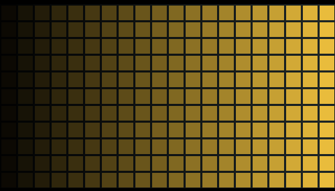

# Overview

This library contains simple examples to understand how to use the main
MicroUI library APIs. It is recommended to study them in the following
order :

- [BasicDrawings](./src/main/java/com/microej/howto/microui/drawing/BasicDrawings.java)

-  [BasicDrawingsAntiAliased](./src/main/java/com/microej/howto/microui/drawing/BasicDrawingsAntiAliased.java>)

-  [Text](./src/main/java/com/microej/howto/microui/font/Text.java)

- [PictosWithCustomFont](./src/main/java/com/microej/howto/microui/font/PictosWithCustomFont.java)

-  [TransparentImages](./src/main/java/com/microej/howto/microui/image/TransparentImages.java)

-  [FlippedImages](./src/main/java/com/microej/howto/microui/image/FlippedImages.java)

-  [RotatedImages](./src/main/java/com/microej/howto/microui/image/RotatedImages.java)

-  [ScaledImages](./src/main/java/com/microej/howto/microui/image/ScaledImages.java)

-  [BufferedImages](./src/main/java/com/microej/howto/microui/image/BufferedImages.java)

-  [DeformedImages](./src/main/java/com/microej/howto/microui/image/DeformedImages.java)

-  [InputEvents](./src/main/java/com/microej/howto/microui/events/InputEvents.java)

- [AnimationSample](./src/main/java/com/microej/howto/microui/animation/AnimationSample.java)

Note that the same set of resources (images and fonts) is used across
all of the examples.

# Usage

## Run on Simulator

1. Right-Click on the example to run ``.java`` file
2. Select **Run As -> MicroEJ Application**
3. Select your platform
4. Press **Ok**

## Run on Device

1. Right-Click on the example to build ``.java`` file
2. Select **Run As -> Run Configurations...**
3. Select **MicroEJ Application** configuration kind
4. Click on **New launch configuration** icon
5. In **Execution** tab
   1. In **Target** frame, in **Platform** field, select a relevant
      platform
   2. In **Execution** frame
      1. Select **Execute on Device**
      2. In **Settings** field, select **Build & Deploy**

6. Press **Apply**
7. Press **Run**

The MicroEJ files for the 3rd-party BSP project are generated, to run the application on the device, 
you must compile the bsp project and then flash the .out file on your board, you can find more explanations in the README of your platform.

# Requirements

This example has been tested on:

-  MicroEJ SDK 5.1
-  With a [Platform](https://github.com/MicroEJ/Platform-STMicroelectronics-STM32F7508-DK) that contains:
   -  EDC-1.3
   -  BON-1.4
   -  MiCROUI-3.1
   -  DRAWING-1.0
   

#Dependencies

*All dependencies are retrieved transitively by Ivy resolver*.

# Credits

 Font  | Author  | License    
|:---:|:---:|:---:|
 Font Awesome  | Dave Gand   http://fontawseome.io |  [SIL OFL 1.1 license-http://scripts.sil.org/OFL](./src/main/resources/fonts/OFL.txt)  
 Sans  | Adobe  | [SIL Open FontLicense.txt](./src/main/resources/fonts/Adobe-Source-SIL-Open-Font-License.txt)  

# Source

N/A

# Restrictions

None.

---  
_Markdown_   
_Copyright 2019-2022 MicroEJ Corp. All rights reserved._   
_Use of this source code is governed by a BSD-style license that can be found with this software._  

