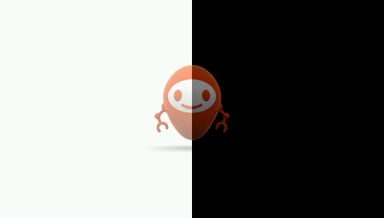
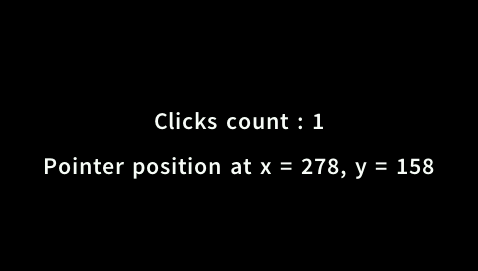

<!--
	Markdown
	Copyright 2016 IS2T. All rights reserved.
	Use of this source code is governed by a BSD-style license that can be found at http://www.is2t.com/open-source-bsd-license/.
-->

# Overview
This library contains simple examples to understand how to use the main MicroUI library APIs. It is recommended to study them in the following order :

- [com.microej.howto.microui.drawing.Primitives](/MicroUI-Get-Started/src/main/java/com/microej/howto/microui/drawing/Primitives.java)

- [com.microej.howto.microui.drawing.PrimitivesAntiAliased](/MicroUI-Get-Started/src/main/java/com/microej/howto/microui/drawing/PrimitivesAntiAliased.java)

- [com.microej.howto.microui.font.Text](/MicroUI-Get-Started/src/main/java/com/microej/howto/microui/font/Text.java)

- [com.microej.howto.microui.font.PictosWithCustomFont](/MicroUI-Get-Started/src/main/java/com/microej/howto/microui/font/PictosWithCustomFont.java)

- [com.microej.howto.microui.image.TransparentImages](/MicroUI-Get-Started/src/main/java/com/microej/howto/microui/image/TransparentImages.java)

- [com.microej.howto.microui.image.FlippedImages](/MicroUI-Get-Started/src/main/java/com/microej/howto/microui/image/FlippedImages.java)

- [com.microej.howto.microui.image.RotatedImages](/MicroUI-Get-Started/src/main/java/com/microej/howto/microui/image/RotatedImages.java)

- [com.microej.howto.microui.image.ScaledImages](/MicroUI-Get-Started/src/main/java/com/microej/howto/microui/image/ScaledImages.java)

- [com.microej.howto.microui.image.TilingWithImages](/MicroUI-Get-Started/src/main/java/com/microej/howto/microui/image/TilingWithImages.java)

- [com.microej.howto.microui.image.DeformedImages](/MicroUI-Get-Started/src/main/java/com/microej/howto/microui/image/DeformedImages.java)

- [com.microej.howto.microui.events.InputEvents](/MicroUI-Get-Started/src/main/java/com/microej/howto/microui/events/InputEvents.java)

- [com.microej.howto.microui.animation.AnimationSampleWithFullRepaint](/MicroUI-Get-Started/src/main/java/com/microej/howto/microui/animation/AnimationSampleWithFullRepaint.java)

- [com.microej.howto.microui.animation.AnimationSampleWithFlyingImage](/MicroUI-Get-Started/src/main/java/com/microej/howto/microui/animation/AnimationSampleWithFlyingImage.java)

Note that the same set of resources (images and fonts) is used across all of the examples.

# Usage
For each example:
## Run on MicroEJ Simulator
1. Right Click on the example to run `.java` file
2. Select **Run as -> MicroEJ Application**
3. Select your platform 
4. Press **Ok**

## Run on device
### Build
1. Right Click on the example to build `.java` file
2. Select **Run as -> Run Configuration** 
3. Select **MicroEJ Application** configuration kind
4. Click on **New launch configuration** icon
5. In **Execution** tab
	1. In **Target** frame, in **Platform** field, select a relevant platform (but not a virtual device)
	2. In **Execution** frame
		1. Select **Execute on Device**
		2. In **Settings** field, select **Build & Deploy**
6. Press **Apply**
7. Press **Run**
8. Copy the generated `.out` file path
	
# Requirements
* MicroEJ Studio or SDK 4.0 or later
* A platform with at least:
	* EDC-1.2 or higher
	* BON-1.2 or higher
	* MICROUI-2.0 or higher

# Dependencies
_All dependencies are retrieved transitively by Ivy resolver_.

# Credits

| 
Font
 | 
Author
 | 
License
 |
| --- | :---: | --- |
| Font Awesome | Dave Gandy   http://fontawseome.io  | [SIL OFL 1.1 license - http://scripts.sil.org/OFL](/MicroUI-Get-Started/src/main/resources/fonts/OFL.txt)|
| Sans | Adobe |[SIL Open Font License.txt](/MicroUI-Get-Started/src/main/resources/fonts/Source - SIL Open Font License.txt)|

# Source
N/A

# Restrictions
None.
