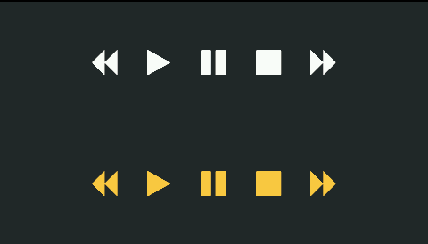
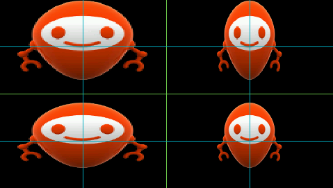

.. Copyright 2019 MicroEJ Corp. All rights reserved.
.. Use of this source code is governed by a BSD-style license that can be found with this software.

Overview
========

This library contains simple examples to understand how to use the main
MicroUI library APIs. It is recommended to study them in the following
order :

-  `com.microej.howto.microui.drawing.Primitives </MicroUI-Get-Started/src/main/java/com/microej/howto/microui/drawing/Primitives.java>`__

.. figure:: screenshots/Primitives.png
   :alt: Primitives

   Primitives

-  `com.microej.howto.microui.drawing.PrimitivesAntiAliased </MicroUI-Get-Started/src/main/java/com/microej/howto/microui/drawing/PrimitivesAntiAliased.java>`__

   PrimitivesAntiAliased

-  `com.microej.howto.microui.font.Text </MicroUI-Get-Started/src/main/java/com/microej/howto/microui/font/Text.java>`__

   Text

-  `com.microej.howto.microui.font.PictosWithCustomFont </MicroUI-Get-Started/src/main/java/com/microej/howto/microui/font/PictosWithCustomFont.java>`__

   PictosWithCustomFont

-  `com.microej.howto.microui.image.TransparentImages </MicroUI-Get-Started/src/main/java/com/microej/howto/microui/image/TransparentImages.java>`__

.. figure:: screenshots/TransparentImages.png
   :alt: TransparentImages

   TransparentImages

-  `com.microej.howto.microui.image.FlippedImages </MicroUI-Get-Started/src/main/java/com/microej/howto/microui/image/FlippedImages.java>`__

   FlippedImages

-  `com.microej.howto.microui.image.RotatedImages </MicroUI-Get-Started/src/main/java/com/microej/howto/microui/image/RotatedImages.java>`__

.. figure:: screenshots/RotatedImages.png
   :alt: RotatedImages

   RotatedImages

-  `com.microej.howto.microui.image.ScaledImages </MicroUI-Get-Started/src/main/java/com/microej/howto/microui/image/ScaledImages.java>`__

.. figure:: screenshots/ScaledImages.png
   :alt: ScaledImages

   ScaledImages

-  `com.microej.howto.microui.image.TilingWithImages </MicroUI-Get-Started/src/main/java/com/microej/howto/microui/image/TilingWithImages.java>`__

.. figure:: screenshots/TilingWithImages.png
   :alt: TilingWithImages

   TilingWithImages

-  `com.microej.howto.microui.image.DeformedImages </MicroUI-Get-Started/src/main/java/com/microej/howto/microui/image/DeformedImages.java>`__

   DeformedImages

-  `com.microej.howto.microui.events.InputEvents </MicroUI-Get-Started/src/main/java/com/microej/howto/microui/events/InputEvents.java>`__

.. figure:: screenshots/InputEvents.png
   :alt: InputEvents

   InputEvents

-  `com.microej.howto.microui.animation.AnimationSampleWithFullRepaint </MicroUI-Get-Started/src/main/java/com/microej/howto/microui/animation/AnimationSampleWithFullRepaint.java>`__

Note that the same set of resources (images and fonts) is used across
all of the examples.

Usage
=====

For each example: 

## Run on MicroEJ Simulator 
---------------------------

1. Right Click on the example to run ``.java`` file
2. Select **Run as -> MicroEJ Application** 
3. Select your platform 4. Press **Ok**

Run on device
-------------

Build
~~~~~

1. Right Click on the example to build ``.java`` file
2. Select **Run as -> Run Configuration**
3. Select **MicroEJ Application** configuration kind
4. Click on **New launch configuration** icon
5. In **Execution** tab

   1. In **Target** frame, in **Platform** field, select a relevant
      platform (but not a virtual device)
   2. In **Execution** frame

      1. Select **Execute on Device**
      2. In **Settings** field, select **Build & Deploy**

6. Press **Apply**
7. Press **Run**
8. Copy the generated ``.out`` file path

Requirements
============

This example has been tested on:

-  MicroEJ SDK 5.1
-  With a Platform Reference that contains:

   -  EDC-1.2
   -  BON-1.2
   -  MiCROUI-2.0

Dependencies
============

*All dependencies are retrieved transitively by Ivy resolver*.

Credits
=======

+------------------+-------------------------------+------------------+
| Font             | Author                        |License           |
+------------------+-------------------------------+------------------+
| Font Awesome     | Dave Gandy                    | `SIL OFL 1.1     |
|                  | http://fontawseome.io         | license -        |
|                  |                               | http://scripts.s |
|                  |                               | il.org/OFL </Mic |
|                  |                               | roUI-Get-Started |
|                  |                               | /src/main/resour |
|                  |                               | ces/fonts/OFL.tx |
|                  |                               | t>`__            |
+------------------+-------------------------------+------------------+
| Sans             | Adobe                         | `SIL Open Font   |
|                  |                               | License.txt </Mi |
|                  |                               | croUI-Get-Starte |
|                  |                               | d/src/main/resou |
|                  |                               | rces/fonts/Adobe |
|                  |                               | -Source-SIL-Open |
|                  |                               | -Font-License.tx |
|                  |                               | t>`__            |
+------------------+-------------------------------+------------------+

Source
======

N/A

Restrictions
============

None.