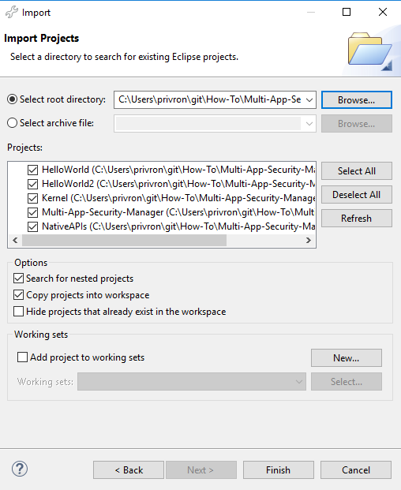
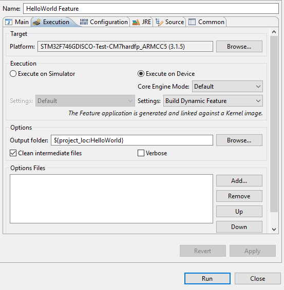
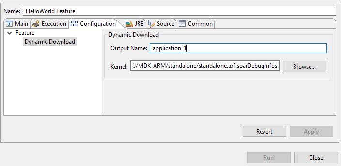

# Overview
This document describes how to add a security manager to a multi-sandboxed platform.
The security manager will provide access to a kernel LED native function to one feature and forbid the access to a second feature.

1. Check the permission before the native call.
2. Add security manager to the kernel.


# Requirements

This tutorial is built upon the [Single-App-to-Multi-App-Platform](../Single-App-to-Multi-App-Platform) platform.
This platform must:
- Implement LEDs native function in the kernel
- Load at least two features


# Setup the workspace

Import the example projects into MicroEJ SDK:
- Click on **File** -> **Import**
- Select **General** -> **Existing Project into Workspace**
- **Browse** to root directory
- Check **Search for nested projects** checkbox
- Select all the projects
- Click on **Finish**
    * 

## Projects Overview

- `Single-App-to-Multi-App-Platform` contains this README
- `HelloWorld` is a feature named "Hello" application using the LED
- `HelloWorld2` is the same feature as `HelloWorld` with a different [kf name](java\HelloWorld2\src\main\resources\kf\Hello.kf) "Hello2" 
- `NativeAPIs` is a project that defines the native functions to manage the LED
- `Kernel` is the kernel entry point and function to load the features


# Check the Permission

1. Create a [LedPermission](NativeAPIs\src\main\java\com\microej\LedPermission.java) class that extends `java.security.BasicPermission`
2. In [Led](NativeAPIs\src\main\java\com\microej\Led.java), check the permission before calling `switchLedNative(boolean on);`

```
/**
 * Switch the led state.
 *
 * @param on
 *            <code>true</code> to switch on the led.
 * @throws SecurityException
 *             when the SecurityManager does not give {@link LedPermission}.
 */
public static void switchLed(boolean on) throws SecurityException {
    SecurityManager securityManager = System.getSecurityManager();
    // SecurityManager may be null if the Kernel has not yet set it.
    if (securityManager != null) {
        securityManager.checkPermission(LedPermission.INSTANCE);
    }
    switchLedNative(on);
}
```


# Set the Security Manager

A simple security manager not checking permissions in Kernel mode and delegating the checks otherwise.

## Create a Security Manager

1. Create [com.microej.kernel.security.KernelSecurityManager](java\Kernel\src\main\java\com\microej\kernel\security\KernelSecurityManager.java) that extends `java.lang.SecurityManager`.
2. Create an interface [com.microej.kernel.security.FeaturePermissionChecker](java\Kernel\src\main\java\com\microej\kernel\security\KernelSecurityManager.java) that defines `public void checkPermission(Permission p, Feature f) throws SecurityException;`    
3. In [com.microej.kernel.security.KernelSecurityManager](java\Kernel\src\main\java\com\microej\kernel\security\KernelSecurityManager.java) overrides `public void checkPermission(Permission permission)` to delegate the check.

```
@Override
public void checkPermission(Permission permission) {
    if(!Kernel.isInKernelMode()){
        Feature feature = (Feature)Kernel.getContextOwner();
        Kernel.enter();
        FeaturePermissionChecker checker = permissionsMap.get(permission.getClass());
        if(checker != null){
            checker.checkPermission(permission, feature);
        } else {
            noCheckerFound(permission, feature);
        }
    } else {
        kernelPermission(permission);
    }
}
```

## Create the Checkers

1. Create [com.microej.kernel.security.LedPermissionChecker](java\Kernel\src\main\java\com\microej\kernel\security\LedPermissionChecker.java) that implements `com.microej.kernel.security.FeaturePermissionChecker`.
    - The permission will only be granted to the features with the name "Hello"

```
@Override
public void checkPermission(Permission p, Feature f) throws SecurityException {
    String name = f.getName();
    if (name == null || !name.equals("Hello")) {
        throw new SecurityException();
    }
}
```

## Instantiate the Security Manager

Modify the Kernel entry point [com.microej.kernel.SimpleKernel.main(String[])](java\Kernel\src\main\java\com\microej\kernel\SimpleKernel.java) to instantiate the SecurityManager.

```
KernelSecurityManager securityManager = new KernelSecurityManager();
securityManager.setFeaturePermissionChecker(LedPermission.class, new LedPermissionChecker());
System.setSecurityManager(securityManager);
```


# Build & Run

## Rebuild the kernel with the security manager implementation

1. In MicroEJ SDK, generate the microejapp.o file
    1. Right-click on the `Kernel` project
    2. Select **Run-As**->**Run Configuration**
    3. Right-click on **MicroEJ Application**
    4. Select **New**
    5. In **Execution** tab
        1. Set your platform
        2. Check **Execute on device**
        3. Set **Settings** to **Build and deploy**
    6. **Run**
    7. In the BSP folder the `microejapp.o` file is generated
    
2. Use a third party C IDE to build the BSP and flash your board

## Build the features

1. In MicroEJ SDK, generate `application_1.fo`
    1. Right-click on the HelloWorld project
    2. Select **Run-As**->**Run Configuration**
    3. Right-click on **MicroEJ Application**
    4. Select **New**
    5. In **Execution** tab
        1. Set your platform
        2. Check **Execute on device**
        3. Set **Settings** to **Build Dynamic Feature**
            * 
    6. In **Configuration** tab
        1. Select **Feature**->**Dynamic Download**
        2. Set the **Output name** to `application_1`
        3. Set the **Kernel** to the object file generated by the third party IDE
            * 
            * If using Keil adding the debug information is required cf **Additional Info** at the bottom of this readme
    7. **Run**
    8. In the output folder (by default generated at the root of `HelloWorld` project) an `application_1.fo` file is generated

2. Generate `application_2.fo`
    - Follow the same steps as *1.* with `HelloWorld2` and using the name `application_2.fo`
3. Copy the `application_1.fo` and `application_2.fo` feature files to a `tmp/` folder at the root of the microSD card.
4. Insert the SD card into the board
5. Reset the board
6. The firmware should run the 2 features
    - `HelloWorld` should make the LED blink
    - A `SecurityException` should be raised in `HelloWorld2`


# Going Further

## Other Permissions

- Other `FeaturePermissionChecker` can be added to the `KernelSecurityManager` for other type of Permission.
    - java.net.SocketPermission
    - java.io.FilePermission
    - ...


# Additional Info

## Adding Debug Info for Keil

Keil strips the debug info from the binary file, a tool is provided in the platform to add them. To generate the object file with the info, follow this steps:

1. **Run -> Run configuration**
2. Create a new MicroEJ Tool configuration
3. In **Execution** tab
    1. Select your platform
    2. Select the tool **Soar debug infos post-linker**
4. In **Configuration** tab
    1. Set the **SOAR object** file to the .o file generated in the `{kernel project output folder}/soar/`
    2. Set the **executable file** to the `.axf` object file generated by Keil
5. Run
6. Update the Hello World launch configuration to use the generated file `standalone.axf.soarDebugInfos` for the kernel

<!--
 - Copyright 2018 IS2T. All rights reserved.
 - For demonstration purpose only.
 - IS2T PROPRIETARY. Use is subject to license terms.
-->
