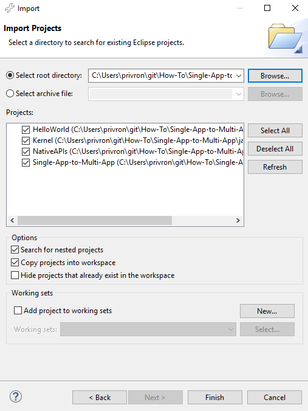
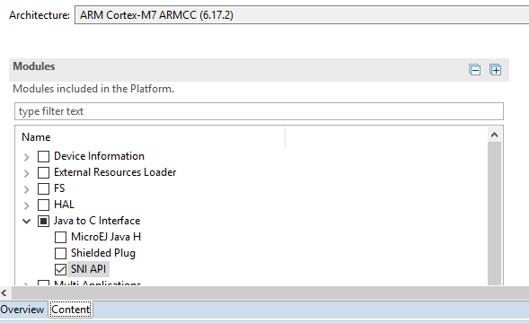
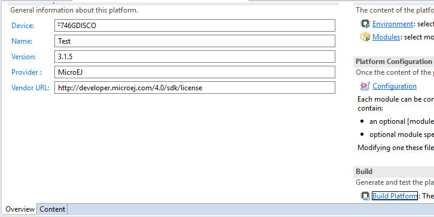
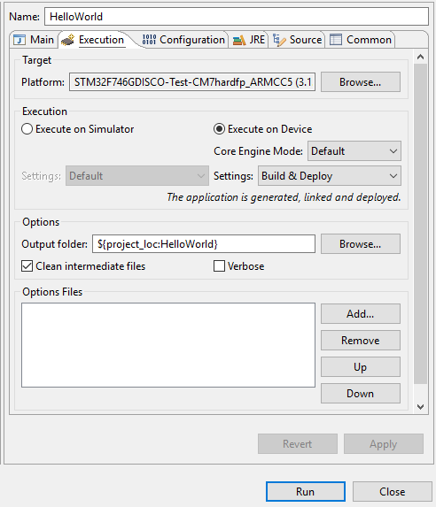
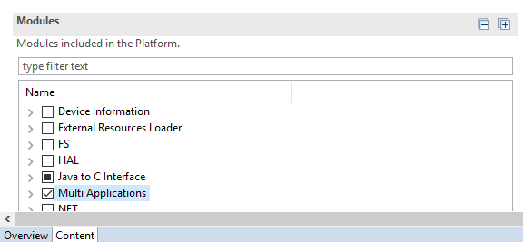
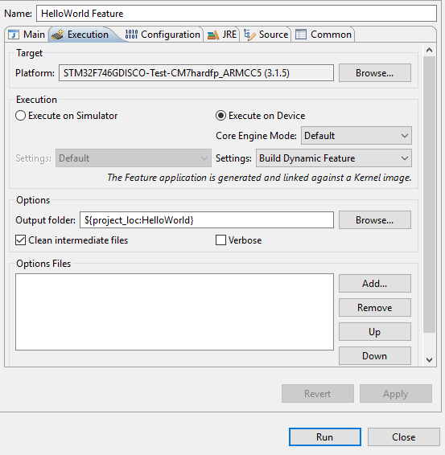
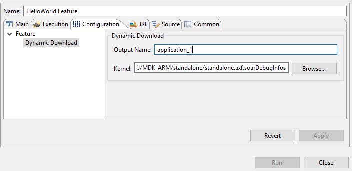

# Overview
This document describes how to go from a monolithic application running on a mono-sandbox platform, to a multi-sandbox platform running multiple APPs securely protected by their own sandbox. This HowTo uses an "Hello World" and turns it into a sandboxed APP.

1. Add a native (C) call to blink an LED in the application
2. Run a Multi Sandbox kernel
3. Adapt the hello world to run as be feature (i.e an APP)


# Requirements

## Hardware Requirements

The native code provided has been created for the STMicroelectronics STM32F746G-DISCO development board available from [st.com](https://www.st.com/en/evaluation-tools/32f746gdiscovery.html).

It can be ported to any hardware with a **LED** and a **File System**.

## Software Requirements

- MicroEJ SDK 4.1.5 or later available from [microej.com](http://developer.microej.com/getting-started-sdk.html)
- A MicroEJ platform reference implementation available from [developer.microej.com](https://developer.microej.com/index.php?resource=JPF)

### STM32F746G-DISCO Platform Reference Implementation requirements

- MicroEJ platform reference implementation STM32F746-DISCO Platform available from [developer.microej.com](http://developer.microej.com/getting-started-sdk-stm.html)
- Keil MDK-ARM version 5.25 available from [keil.com](http://www2.keil.com/mdk5)

## Prerequisite Knowledge

This tutorial is built upon an understanding of the MicroEJ SDK, MicroEJ architectures, MicroEJ Platforms and MicroEJ applications as well as at least one native BSP compiler and IDE.

The user of this tutorial should be able to create a "Hello World" application in Java, build the application, build the BSP and flash the firmware image onto the targeted board.

Other development boards, reference platforms and compilers can be used, however the instructions in this tutorial are specifically written for these items and will not apply without changes to other environments.


# Setup the workspace

Import the example projects into MicroEJ SDK:
- Click on **File** -> **Import**
- Select **General** -> **Existing Project into Workspace**
- **Browse** to root directory
- Check **Search for nested projects** checkbox
- Select all the projects
- Click on **Finish**
    * 

## Projects Overview
- `Single-App-to-Multi-App-Platform` contains this README
- `HelloWorld` is a standalone application that will be used as a feature
- `NativeAPIs` is a project that defines the native functions to manage the LED
- `Kernel` is the kernel entry point and function to load a feature


# Add a Native Function in the Platform to Control a LED

Modify the platform to add the capability to call a native C function from Java.

1. Configure modules
    1. Open the [XXX]-configuration/[XXX].platform` file
    2. Go to **Content** tab.
    3. Check **Java to C interface**->**SNI API** module
        * 

2. Build the platform
    1. Go to **Overview** tab
    2. Click on **Build Platform** in the **Overview**->**Build section**
    3. Once the platform is built, the [Platform-name]-[version]` project is created in the workspace
        * 

3. Add a native call to the HelloWorld Java application
    1. Native function definition
       - The project `NativeAPIs` is used to define the native functions
       - [com.microej.Led](java/NativeAPIs/src/main/java/com/microej/Led.java) defines the native function to manage the LED
            - `Led.initNative()` is called at the start-up to initialize the LED
            `private static native void initNative();`
            - `Led.switchLed(boolean on)` is called to set the state of the LED
                - `public static void switchLed(boolean on);` provides the APIs to the java code.
                - `private static native void switchLedNative(boolean on);`
       - Optional, but recommended: To use the simulator a Mock should be created. An example of a mock usage is provided in [Example-Standalone-Java-C-Interface](https://github.com/MicroEJ/Example-Standalone-Java-C-Interface/tree/master/CallingCFromJava#adding-a-mock-of-the-native-function-to-the-jpf)
    2. Call the native function in the HelloWorld application
        - The project `HelloWorld` depends on `NativeAPIs`
        - [com.microej.feature.HelloWorld](java/HelloWorld/src/main/java/com/microej/feature/HelloWorld.java) uses `LED` to toggle the LED

4. Build the HelloWorld Java application
    1. Right-click on the HelloWorld project
    2. Select **Run-As**->**Run Configuration**
    3. Right-click on **MicroEJ Application**
    4. Select **New**
    5. In **Execution** tab
        1. Set your platform that was built in step 3
        2. Check **Execute on device**
        3. Set **Settings** to **Build and deploy**
    6. **Run** will generated a `microejapp.o` in the platform BSP folder
        * 

5. Add the native LED C implementation to the BSP in the third party C IDE
    - [LEDs.c](native/src-led/LEDs.c) provides the implementation of the native C function defined in `NativeAPIs`
    - This implementation is done for the STM32F746-DISCO board, to add it to Keil IDE follow these steps:
        1. Open the Keil project in the platform [XXX]-bsp/ project
        2. Right-click on the `MicroEJ/Core` folder
        3. Select **Add Existing Files to Group 'MicroEJ/Core'**
            1. Browse to the file [LEDs.c](native/src-led/LEDs.c) in the native repository
            2. Click **Add**
            3. Click **Close**
        4. Build the project by pressing **F7**
        5. Flash the firmware on the board pressing **F8**
        6. Verify the Green LED LD1 is blinking on for one second and off for one second


# Run a Multi-App Kernel
This section will adapt the existing MicroEJ platform project to run a Kernel with KF support.

## Adapt the Platform to Support KF
1. Configure the platform modules
    1. Open the [XXX]-configuration/[XXX].platform` file
    2. Go to **Content** tab.
    3. Check **Multi Applications** module
        * 

2. Build the platform
    1. Go to **Overview** tab
    2. Click on **Build Platform** in the **Overview**->**Build section**
    3. Once the platform is built, the [Platform-name]-[version]` project is created in the workspace
        * 

3. Implement KF low level C APIs in the BSP project
    - `LLKERNEL_impl.h` has been added to the MicroEJ headers directory, this file is used for the RAM buffer where the APPs are dynamically linked
        - [LLKERNEL_SDRAM.c](native/src-kf/LLKERNEL_SDRAM.c) is an implementation using the on-board SDRAM
        - Add the implementation to your BSP project using the third party C IDE
            1. Using the Keil IDE, right-click on the `MicroEJ/Core` folder
            2. Select **Add Existing Files to Group 'MicroEJ/Core'**
                1. Browse to the file [LLKERNEL_SDRAM.c](native/src-kf/LLKERNEL_SDRAM.c) in the native repository
                2. Click **Add**
                3. Click **Close**

## Build the Kernel

### Create the kernel project

1. Expose the foundation APIs to the feature
    - In the [module.ivy](java/Kernel/module.ivy), the example depends on:
        - `ej.api#edc`: to provide the EDC Java APIs to the kernel
        - `ej.api#bon`: to provide the BON Java APIs to the kernel
        - `ej.api#kf`: to provide the KF APIs to the kernel to load a feature
        - `com.microej.kernelapi#edc`: to provide the EDC APIs to the feature
        - `com.microej.kernelapi#bon`: to provide the BON APIs to the feature

2. Add a way to load a feature
    - An example is provided in [kernel](java/Kernel)
        - [com.microej.kernel.FeatureInputStream](java/Kernel/src/main/java/com/microej/kernel/FeatureInputStream.java) is used to create an input stream to receive the feature.
        - [com.microej.kernel.SimpleKernel](java/Kernel/src/main/java/com/microej/kernel/SimpleKernel.java) gets a feature input stream and loads it.

3. Add an entry point
    - [SimpleKernel.java](java/Kernel/src/main/java/com/microej/kernel/SimpleKernel.java) provides a main to load the features.

4. Expose the native function to the feature
    - Features cannot access classes and methods which are not exposed by the Kernel. To provide the feature access to the `Led` class and the `switchLed` method:
        1. Add a dependency to the `NativeAPIs` library in the Kernel project
        2. Create [kernel.api](java/Kernel/src/main/resources/kernel.api) file at the root of a /resources folder
             - Define the types that are open to the Features
             - Define the methods that are open to the Features

5. Generate the microejapp.o file
    1. Right-click on the `Kernel` project
    2. Select **Run-As**->**Run Configuration**
    3. Right-click on **MicroEJ Application**
    4. Select **New**
    5. In **Execution** tab
        1. Set your platform
        2. Check **Execute on device**
        3. Set **Settings** to **Build and deploy**
    6. **Run**
    7. In the BSP folder the `microejapp.o` file is generated

### Adapt the platform

- [com.microej.kernel.FeatureInputStream](java/Kernel/src/main/java/com/microej/kernel/FeatureInputStream.java) expects the native functions
    - `void Java_com_microej_kernel_FeatureInputStream_init()` is called once to initialize the native stack
    - `jboolean Java_com_microej_kernel_FeatureInputStream_isFeatureAvailable()` to check if a feature is available
    - `jint Java_com_microej_kernel_FeatureInputStream_readIntoArray(jbyte *out, jint outOffset, jint outLen)` to read the data
    - `void Java_com_microej_kernel_FeatureInputStream_closeFeature()` to close the feature stream
    - An example using FatFs file system (FS) is provided in [inputStream.c](native/src-feature/inputStream.c)
        - This example will look for features in the FS /tmp/application_1.fo first, then , once the feature is loaded, increment the feature search number.

- Add the implementation to your BSP project using the third party C IDE
    1. Using the Keil IDE, right-click on the `MicroEJ/Core` folder
    2. Select **Add Existing Files to Group 'MicroEJ/Core'**
        1. Browse to the file [inputStream.c](native/src-feature/inputStream.c)` in the native repository
        2. Click **Add**
        3. Click **Close**

### Build

1. Build and Run using the third party C IDE.
    1. Using the Keil IDE, build the project pressing **F7**
    3. Flash the firmware on the board pressing **F8**
    4. Verify the Green LED LD1 is blinking on for one second and off for one second
2. The firmware output should wait for a feature

```
   start
   VM START
   Looking for feature /tmp/application_1.fo
   Hello.main()
   Start kernel
   [K] get inputstream...
   Waiting for a feature to be available
```


# Adapt the Hello World to Run as a Feature

1. Add a dependency to ej.api#kf to `HelloWorld`
    - [module.ivy](java/HelloWorld/module.ivy) contains a dependency to `<dependency org="ej.api" name="kf" rev="[1.4.0-RC0,2.0.0-RC0[" conf="provided->*" />`
2. Create a `FeatureEntryPoint` that calls back `com.microej.feature.HelloWorld.main()` on the `start()`
    - [com.microej.feature.MyFeatureEntryPoint](java/HelloWorld/src/main/java/com/microej/feature/MyFeatureEntryPoint.java) does it
3. Add a [FeatureName].kf file to your features resources see [Hello.kf](java/HelloWorld/src/main/resources/kf/Hello.kf)
    1. Define the feature version with `version=`
    2. Define the feature name with `name=`
    3. Define the feature entry point with `entryPoint=` fully qualified name of the entry point
    4. Define the feature types with `types=` to the package managed by the feature
4. Add a [FeatureName].cert certificate
     - This certificate will be used when adding a security manager to the kernel (not used currently)
5. Build the feature
    1. Right-click on the HelloWorld project
    2. Select **Run-As**->**Run Configuration**
    3. Right-click on **MicroEJ Application**
    4. Select **New**
    5. In **Execution** tab
        1. Set your platform
        2. Check **Execute on device**
        3. Set **Settings** to **Build Dynamic Feature**
            * 
    6. In **Configuration** tab
        1. Select **Feature**->**Dynamic Download**
        2. Set the **Output name** to `application_1`
        3. Set the **Kernel** to the object file generated by the third party IDE
            * 
            * If using Keil adding the debug information is required cf **Additional Info** at the bottom of this readme
    7. **Run**
    8. In the output folder (by default generated at the root of `HelloWorld` project) an `application_1.fo` file is generated
5. Copy the `application_1.fo` feature file to a `tmp/` folder at the root of the microSD card.
6. Insert the SD card into the board
7. Reset the board
8. The firmware should run the feature

```
   start
   VM START
   Looking for feature /tmp/application_1.fo
   Hello.main()
   Start kernel
   [K] get inputstream...
   Waiting for a feature to be available
   Application available. Loading application.
   [K] load&start app
   [K] app loaded
   close
   Looking for feature /tmp/application_2.fo
   [K] get inputstream...
   Waiting for a feature to be available
   feature started
   Hello World !
```


# Going Further

MicroEJ provides an optional layer (Wadapps) that gives more abstraction and tools to manage applications lifecycle and deployment . An example of Minimal Wadapps firmware is available here: [Example-MinimalMultiAppFirmware](https://github.com/MicroEJ/Example-MinimalMultiAppFirmware).


# Troubleshooting

## ej.kf.IncompatibleFeatureException

When loading the `.fo` file a `ej.kf.IncompatibleFeatureException` exception can be raised.
This exception occurs when the kernel has changed since the `.fo` file generation.

### Solution

1. Regenerate the `.fo` file
2. Copy the `application_1.fo` feature file to a `tmp/` folder at the root of the microSD card.
3. Insert the SD card into the board
4. Reset the board

If the error still occurs, check that the kernel used for the generation of the `.fo` file is the kernel flashed on the board.

## [M101] - Input image file has no debug information :

When building the `application_1.fo` file an error **M101** occurs

```
1 : SOAR ERROR
   [M101] - Input image file has no debug information : {path to the file}.
2 : SOAR ERROR
   [M0] - Internal SOAR error. Please contact MicroEJ support. (-1)

FAIL
Soar image generation aborted.
```

### Solution

If using Keil adding the debug information is required cf **Additional Info** at the bottom of this readme


# Additional Info

## Adding Debug Info for Keil

Keil strips the debug info from the binary file, a tool is provided in the platform to add them. To generate the object file with the info, follow this steps:

1. **Run -> Run configuration**
2. Create a new MicroEJ Tool configuration
3. In **Execution** tab
    1. Select your platform
    2. Select the tool **Soar debug infos post-linker**
4. In **Configuration** tab
    1. Set the **SOAR object** file to the .o file generated in the `{kernel project output folder}/soar/`
    2. Set the **executable file** to the `.axf` object file generated by Keil
5. Run
6. Update the Hello World launch configuration to use the generated file `standalone.axf.soarDebugInfos` for the kernel

<!--
 - Copyright 2018 IS2T. All rights reserved.
 - For demonstration purpose only.
 - IS2T PROPRIETARY. Use is subject to license terms.
-->
